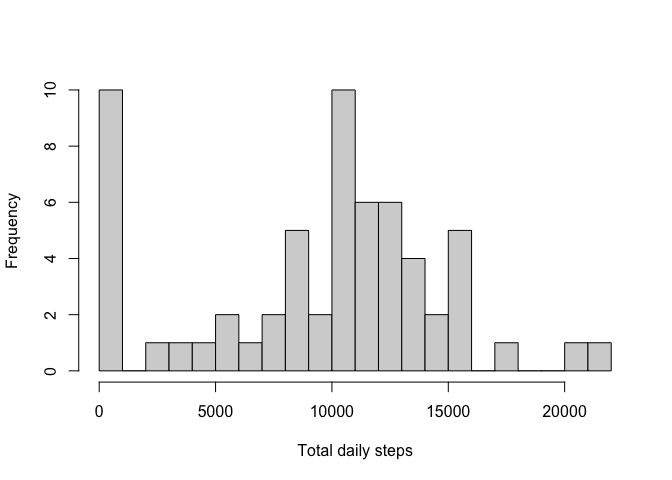
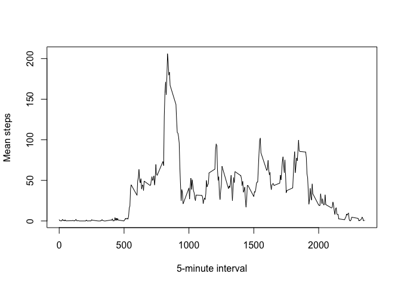
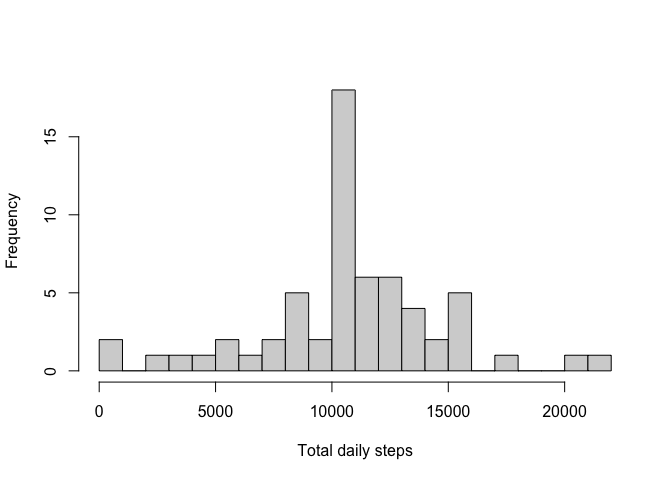
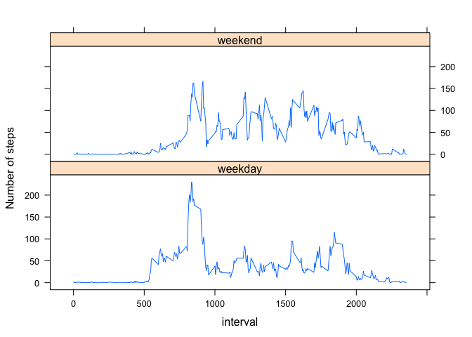

## Load libraries

```r
library(tidyverse)
```

```
## ── Attaching packages ──────────────────────────────────────────────────── tidyverse 1.3.0 ──
```

```
## ✓ ggplot2 3.3.2     ✓ purrr   0.3.4
## ✓ tibble  3.0.3     ✓ dplyr   1.0.2
## ✓ tidyr   1.1.2     ✓ stringr 1.4.0
## ✓ readr   1.3.1     ✓ forcats 0.5.0
```

```
## ── Conflicts ─────────────────────────────────────────────────────── tidyverse_conflicts() ──
## x dplyr::filter() masks stats::filter()
## x dplyr::lag()    masks stats::lag()
```

```r
library(lattice)
```

## Loading and preprocessing the data


```r
data <- read_csv("activity.csv")
```

```
## Parsed with column specification:
## cols(
##   steps = col_double(),
##   date = col_date(format = ""),
##   interval = col_double()
## )
```

```r
data$date <- as.Date(data$date, "%y-%m-%d")
```

## What is mean total number of steps taken per day?


```r
sum_steps <- data %>% 
  group_by(date) %>% 
  summarize(sum = sum(steps, na.rm = TRUE))
```

```
## `summarise()` ungrouping output (override with `.groups` argument)
```

```r
hist(sum_steps$sum, 
     breaks = 20, 
     main = "", 
     xlab = "Total daily steps")
```

<!-- -->

```r
mean_daily_steps <- mean(sum_steps$sum)
median_daily_steps <- median(sum_steps$sum)
```

Calculated main daily steps is 9354.2295082 and median daily steps is 1.0395\times 10^{4}.

## What is the average daily activity pattern?


```r
mean_steps_by_int <- data %>% 
  group_by(interval) %>% 
  summarize(mean = mean(steps, na.rm = TRUE))
```

```
## `summarise()` ungrouping output (override with `.groups` argument)
```

```r
with(mean_steps_by_int, 
     plot(interval, mean, 
          ylab = "Mean steps",
          xlab = "5-minute interval",
          type = 'l'))
```

<!-- -->

```r
max_interval <- mean_steps_by_int[[which.max(mean_steps_by_int$mean), "interval"]]
```

The interval which contains the maximum number of steps on average is 835.

## Imputing missing values


```r
missing_no <- sum(complete.cases(data))

impute.mean <- function(x) replace(x, is.na(x), mean(x, na.rm = TRUE))
data_imputed <- data %>% 
  group_by(interval) %>%
  mutate(steps = impute.mean(steps))

sum_steps_imputed <- data_imputed %>% 
  group_by(date) %>% 
  summarize(sum = sum(steps))
```

```
## `summarise()` ungrouping output (override with `.groups` argument)
```

```r
hist(sum_steps_imputed$sum, 
     breaks = 20, 
     main = "", 
     xlab = "Total daily steps")
```

<!-- -->

```r
mean_daily_steps_imputed <- mean(sum_steps_imputed$sum)
median_daily_steps_imputed <- median(sum_steps_imputed$sum)
```

There are 15264 rows containing NAs. Following imputation by using the mean value of steps at that interval across all days, the recalculated mean total steps per day was 1.0766189\times 10^{4} and the median was 1.0766189\times 10^{4}. These values are identical to each other and are larger than the values calculated above. This method of imputation added many cases of the same value to the dataset, which was the mean, therefore causing a higher peak than normal, as visible on the histogram. A more sophisticated imputation method may have dampened this effect.

## Are there differences in activity patterns between weekdays and weekends?


```r
is.weekday <- function(x) ifelse(weekdays(x) %in% c("Saturday","Sunday"), "weekend", "weekday")

data_imputed <- data_imputed %>% mutate(day_of_week = as.factor(is.weekday(date)))
data_imputed_means <- data_imputed %>% group_by(interval, day_of_week) %>% summarize(mean = mean(steps))
```

```
## `summarise()` regrouping output by 'interval' (override with `.groups` argument)
```

```r
xyplot(mean ~ interval | day_of_week, 
       data = data_imputed_means, 
       type = 'l', 
       layout = c(1, 2), 
       ylab = 'Number of steps')
```

<!-- -->

